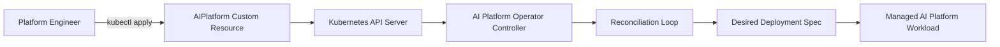
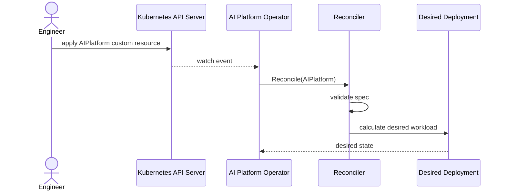

# Kubernetes Operator in Go — AI Platform Operator

A portfolio-grade Kubernetes Operator project built as part of an AI Platform Engineer roadmap.

Day 1 creates the foundation: a custom platform API, CRD manifest, testable reconciliation logic, Docker support, GitHub Actions and documentation.

## Roadmap Context

This is Project 1 in Phase 2: **Kubernetes Operator (Go)**. The project focuses on Go, Kubebuilder-style operator concepts, CRDs, controllers and the reconciliation loop.

## Features — Day 1

- `AIPlatform` custom resource model in Go.
- Kubernetes CRD manifest for `aiplatforms.platform.mady.dev`.
- Reconciler that validates intent and calculates desired deployment state.
- Unit tests for API defaults, validation and reconciliation.
- Dockerfile for the operator binary.
- GitHub Actions CI for format, vet, tests and build.
- Architecture and sequence diagrams.
- LinkedIn post draft for public progress tracking.

## Architecture



## Reconciliation Flow



## Repository Structure

```text
.
├── api/v1                     # Custom resource types
├── cmd/operator               # Operator entrypoint
├── config/crd                 # CRD manifests
├── config/rbac                # RBAC scaffold
├── config/samples             # Example custom resource
├── docs                       # Architecture, sequence and daily notes
├── internal/controller        # Reconciliation logic
├── .github/workflows          # CI pipeline
├── Dockerfile
├── Makefile
└── README.md
```

## Run Locally

```bash
make test
make build
make run
```

Expected output:

```text
result=desired deployment calculated deployment=demo-ai-platform-workload image=nginx:1.27-alpine replicas=1
```

## Kubernetes Manifests

```bash
kubectl apply -f config/crd/platform.mady.dev_aiplatforms.yaml
kubectl apply -f config/samples/platform_v1_aiplatform.yaml
```

## CI

The GitHub Actions workflow runs:

```bash
gofmt check
go vet ./...
go test ./...
go build ./cmd/operator
```

## Day-by-Day Plan

- **Day 1:** Foundation: API type, CRD, basic reconciler, tests, docs and CI.
- **Day 2:** Architecture evolution: client abstraction, create/update logic and status handling.
- **Day 3:** Production readiness: Docker/Kubernetes manifests, deployment, service account and deeper CI.
- **Day 4:** Advanced features and polish: metrics, final docs, screenshots checklist and portfolio-ready README.

## License

MIT
