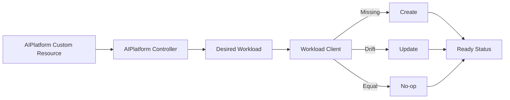

# Platform Engineering Kubernetes Operator

[](https://github.com/abdallauno1/platform-engineering-kubernetes-operator/actions/workflows/ci.yml)
[](https://go.dev/)
[](LICENSE)

A portfolio-grade Kubernetes Operator project written in Go. It demonstrates how a controller translates an `AIPlatform` custom resource into managed workload state through a deterministic and idempotent reconciliation loop.

## Day 2 Highlights

- Custom `AIPlatform` API and CRD.
- Client abstraction for infrastructure operations.
- Create, update, and no-op reconciliation paths.
- Drift detection and idempotency.
- Status phases with observed generation and ready replicas.
- Unit tests for the main controller behaviors.
- GitHub Actions for formatting, vetting, race-enabled tests, coverage, and build.
- Docker image support and Kubernetes RBAC/CRD samples.
- Architecture, sequence, daily notes, and LinkedIn drafts.

## Architecture



## Reconciliation Behavior

| Current state | Desired state | Action |
|---|---|---|
| Workload missing | Valid resource | `Created` |
| Workload differs | New image, replicas, env, or labels | `Updated` |
| Workload matches | No drift | `Unchanged` |
| Invalid resource | Validation failure | `Failed` |

## Repository Structure

```text
.
├── .github/workflows/ci.yml   # Continuous integration
├── api/v1                     # Custom resource types and status
├── cmd/operator               # Local operator demonstration
├── config/crd                 # CRD manifest
├── config/rbac                # Controller RBAC
├── config/samples             # Sample AIPlatform resource
├── docs                       # Architecture and daily documentation
├── internal/controller        # Reconciler, client abstraction, workload model
├── scripts/verify.sh          # Local CI verification
├── Dockerfile
├── Makefile
└── README.md
```

## Requirements

- Go 1.23+
- Docker, optionally
- Kubernetes CLI and cluster, optionally for manifests

## Run Locally

```bash
make ci
make run
```

Expected output:

```text
iteration=1 action=Created phase=Ready message="managed workload created" readyReplicas=2
iteration=2 action=Unchanged phase=Ready message="managed workload already matches desired state" readyReplicas=2
iteration=3 action=Updated phase=Ready message="managed workload updated after drift detection" readyReplicas=3
```

## Tests and Coverage

```bash
make test
make coverage
```

## Docker

```bash
make docker-build
docker run --rm ai-platform-operator:day2
```

## Kubernetes API Manifests

```bash
kubectl apply -f config/crd/platform.mady.dev_aiplatforms.yaml
kubectl apply -f config/samples/platform_v1_aiplatform.yaml
kubectl get aiplatforms
```

The Day 2 runtime uses an in-memory client to keep reconciliation behavior independently testable. Day 3 will add the installable operator deployment, service account, role binding, health probes, and production-focused Kubernetes packaging.

## Project Roadmap

- [x] **Day 1 — Foundation:** API model, CRD, basic reconciliation, tests, Docker, docs.
- [x] **Day 2 — Architecture evolution:** client abstraction, drift detection, create/update/no-op, status.
- [ ] **Day 3 — Production readiness:** operator deployment, RBAC binding, health checks, container CI.
- [ ] **Day 4 — Advanced features and polish:** metrics, final documentation, release and portfolio polish.

## Documentation

- [Day 1 notes](docs/day1.md)
- [Day 2 notes](docs/day2.md)
- [Architecture](docs/architecture.md)
- [Sequence diagram](docs/sequence.md)
- [Day 1 LinkedIn post](docs/linkedin-day1.md)
- [Day 2 LinkedIn post](docs/linkedin-day2.md)

## License

MIT © 2026 Abdalla Mady
