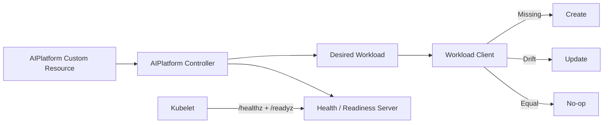

# Platform Engineering Kubernetes Operator

[](https://github.com/abdallauno1/platform-engineering-kubernetes-operator/actions/workflows/ci.yml)
[](https://go.dev/)
[](LICENSE)

A portfolio-grade Kubernetes Operator project written in Go. It demonstrates deterministic reconciliation, drift detection, status management, production runtime concerns, Kubernetes packaging and CI-driven container validation.

## Day 3 Highlights

- Long-running operator process with periodic reconciliation.
- Kubernetes-compatible `/healthz` and `/readyz` probes.
- Graceful SIGTERM/SIGINT shutdown.
- Namespace, ServiceAccount, ClusterRole, ClusterRoleBinding and Deployment manifests.
- Hardened non-root, read-only, distroless container runtime.
- CPU/memory requests and limits.
- Kustomize installation entry point and NetworkPolicy baseline.
- GitHub Actions: formatting, vet, race-enabled tests, coverage, build and Docker image build.
- Updated architecture, sequence diagram, Day 3 documentation and LinkedIn post.

## Architecture



## Reconciliation Behavior

| Current state | Desired state | Action |
|---|---|---|
| Workload missing | Valid resource | `Created` |
| Workload differs | New image, replicas, env, or labels | `Updated` |
| Workload matches | No drift | `Unchanged` |
| Invalid resource | Validation failure | `Failed` |

## Repository Structure

```text
.
├── .github/workflows/ci.yml   # Go CI + container build
├── api/v1                     # Custom resource types and status
├── cmd/operator               # Demo and long-running operator runtime
├── config/crd                 # CRD manifest
├── config/manager             # Namespace + controller Deployment
├── config/network-policy      # NetworkPolicy baseline
├── config/rbac                # ServiceAccount, role and binding
├── config/samples             # Sample AIPlatform resource
├── docs                       # Architecture, sequence and daily docs
├── internal/controller        # Reconciler, client abstraction, workload model
├── internal/health            # Liveness/readiness server and tests
├── scripts/verify.sh          # Local CI verification
├── Dockerfile
├── Makefile
└── README.md
```

## Requirements

- Go 1.23+
- Docker for image build/run
- `kubectl` + Kubernetes cluster for deployment
- Kustomize support through modern `kubectl apply -k`

## Verify Locally

```bash
make ci
./scripts/verify.sh
```

## Run the Reconciliation Demo

```bash
make run
```

Expected behavior:

```text
iteration=1 action=Created ...
iteration=2 action=Unchanged ...
iteration=3 action=Updated ...
```

## Run the Long-Lived Operator Runtime

```bash
make operator
```

In another terminal:

```bash
curl -i http://localhost:8081/healthz
curl -i http://localhost:8081/readyz
```

Both endpoints should return HTTP 200 after the initial reconciliation succeeds.

## Docker

```bash
make docker-build
make docker-run
```

Then verify probes:

```bash
curl http://localhost:8081/healthz
curl http://localhost:8081/readyz
```

## Install on Kubernetes

Build the image first:

```bash
make docker-build
```

For a local cluster such as kind/minikube, load the local image using that cluster's normal image-loading command. Then install all manifests:

```bash
kubectl apply -k config
kubectl get pods -n ai-platform-system
kubectl get aiplatforms
```

Apply the sample resource:

```bash
kubectl apply -f config/samples/platform_v1_aiplatform.yaml
kubectl get aiplatforms
```

> **Architecture scope:** Day 3 packages the controller as a Kubernetes workload and hardens its runtime. The reconciliation engine still talks through the `WorkloadClient` abstraction backed by the in-memory implementation; a concrete Kubernetes API client is not claimed here.

## Project Roadmap

- [x] **Day 1 — Foundation:** API model, CRD, basic reconciliation, tests, Docker, docs.
- [x] **Day 2 — Architecture evolution:** client abstraction, drift detection, create/update/no-op, status.
- [x] **Day 3 — Production readiness:** deployment, RBAC binding, health checks, graceful shutdown, container CI.
- [ ] **Day 4 — Advanced features and polish:** metrics, advanced integration, release automation and final portfolio polish.

## Documentation

- [Day 1 notes](docs/day1.md)
- [Day 2 notes](docs/day2.md)
- [Day 3 notes](docs/day3.md)
- [Architecture](docs/architecture.md)
- [Sequence diagram](docs/sequence.md)
- [Day 1 LinkedIn post](docs/linkedin-day1.md)
- [Day 2 LinkedIn post](docs/linkedin-day2.md)
- [Day 3 LinkedIn post](docs/linkedin-day3.md)

## License

MIT © 2026 Abdalla Mady
