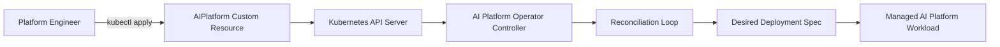

# Day 1 Architecture

## Components

- **AIPlatform CRD** defines the platform intent: image, replicas and environment variables.
- **Controller/Reconciler** validates the custom resource and computes desired workload state.
- **Manifests** provide the first installable Kubernetes API surface.

Day 1 intentionally keeps cluster-side mutation abstracted in Go so the reconciliation logic is easy to test without a Kubernetes cluster.
