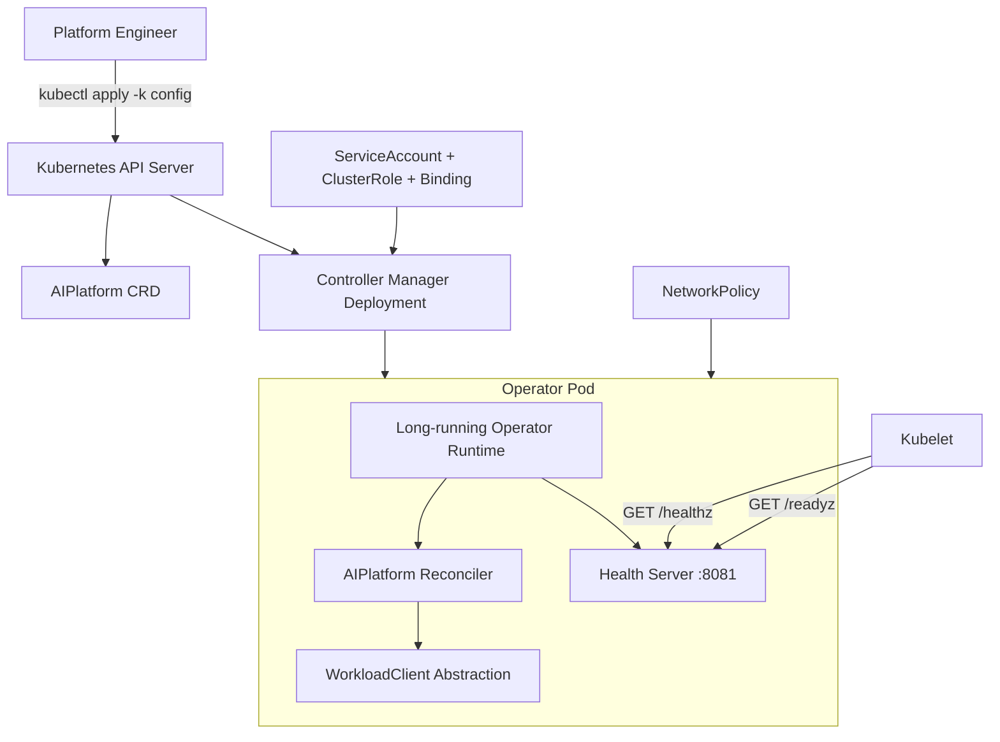

# Day 3 Architecture — Production Runtime and Kubernetes Packaging

## Production-readiness decisions

- Distroless, non-root image minimizes runtime surface area.
- Read-only root filesystem and dropped Linux capabilities reduce container privileges.
- Liveness and readiness endpoints are independent so Kubernetes can distinguish process health from controller readiness.
- Resource requests and limits make scheduling behavior explicit.
- Kustomize provides a single installation entry point without duplicating manifests.
- CI gates the container build on successful formatting, vetting, race-enabled tests and Go build.
