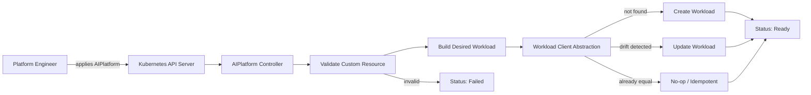

# Day 2 Architecture — Reconciliation with State Management

## Architecture decisions

- `WorkloadClient` isolates reconciliation logic from a concrete Kubernetes client.
- `MemoryWorkloadClient` makes create/update/idempotency behavior testable without a cluster.
- Desired and current state are compared before mutation.
- Reconciliation returns explicit actions: `Created`, `Updated`, `Unchanged`, or `Failed`.
- Status records phase, message, observed generation, and ready replicas.

Day 3 will replace the demonstration runtime with installable operator deployment manifests and production-oriented container/Kubernetes configuration.
