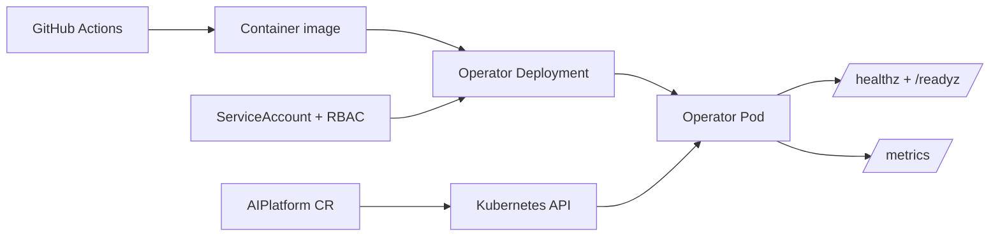

# Deployment diagram

```mermaid
flowchart LR
  GH[GitHub Actions] --> IMG[Container image]
  IMG --> DEP[Operator Deployment]
  DEP --> POD[Operator Pod]
  KAPI[Kubernetes API] --> POD
  POD --> H[/healthz + /readyz/]
  POD --> M[/metrics/]
  CR[AIPlatform CR] --> KAPI
  RBAC[ServiceAccount + RBAC] --> DEP
```
