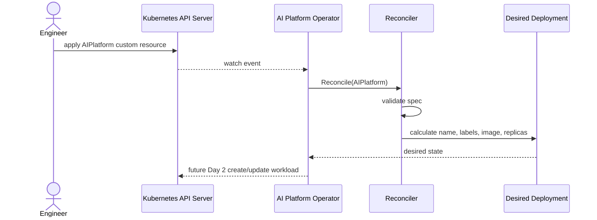

# Day 1 Reconciliation Sequence

```mermaid
sequenceDiagram
    actor Engineer
    participant API as Kubernetes API Server
    participant Operator as AI Platform Operator
    participant Reconciler
    participant Deployment as Desired Deployment

    Engineer->>API: apply AIPlatform custom resource
    API-->>Operator: watch event
    Operator->>Reconciler: Reconcile(AIPlatform)
    Reconciler->>Reconciler: validate spec
    Reconciler->>Deployment: calculate name, labels, image, replicas
    Deployment-->>Operator: desired state
    Operator-->>API: future Day 2 create/update workload
```
