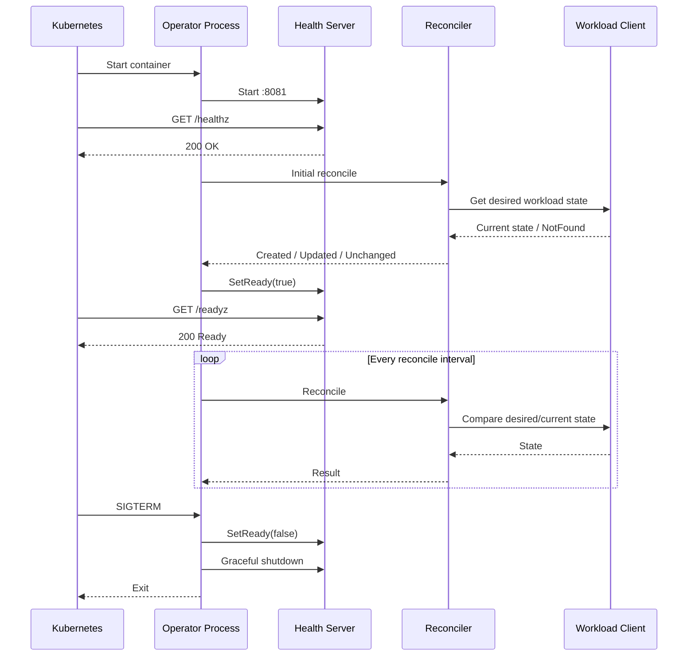

# Day 3 Runtime Sequence

```mermaid
sequenceDiagram
    participant K as Kubernetes
    participant P as Operator Process
    participant H as Health Server
    participant R as Reconciler
    participant C as Workload Client

    K->>P: Start container
    P->>H: Start :8081
    K->>H: GET /healthz
    H-->>K: 200 OK
    P->>R: Initial reconcile
    R->>C: Get desired workload state
    C-->>R: Current state / NotFound
    R-->>P: Created / Updated / Unchanged
    P->>H: SetReady(true)
    K->>H: GET /readyz
    H-->>K: 200 Ready

    loop Every reconcile interval
        P->>R: Reconcile
        R->>C: Compare desired/current state
        C-->>R: State
        R-->>P: Result
    end

    K->>P: SIGTERM
    P->>H: SetReady(false)
    P->>H: Graceful shutdown
    P-->>K: Exit
```
