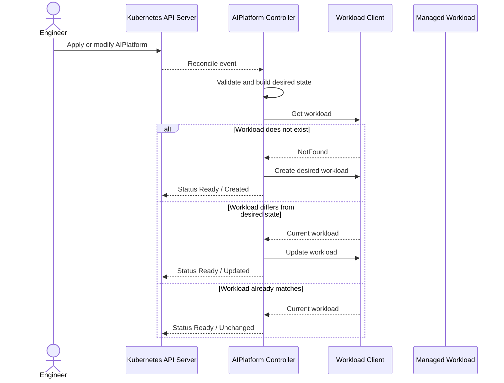

# Day 2 Reconciliation Sequence

```mermaid
sequenceDiagram
    actor Engineer
    participant API as Kubernetes API Server
    participant Controller as AIPlatform Controller
    participant Client as Workload Client
    participant Workload as Managed Workload

    Engineer->>API: Apply or modify AIPlatform
    API-->>Controller: Reconcile event
    Controller->>Controller: Validate and build desired state
    Controller->>Client: Get workload

    alt Workload does not exist
        Client-->>Controller: NotFound
        Controller->>Client: Create desired workload
        Controller-->>API: Status Ready / Created
    else Workload differs from desired state
        Client-->>Controller: Current workload
        Controller->>Client: Update workload
        Controller-->>API: Status Ready / Updated
    else Workload already matches
        Client-->>Controller: Current workload
        Controller-->>API: Status Ready / Unchanged
    end
```
