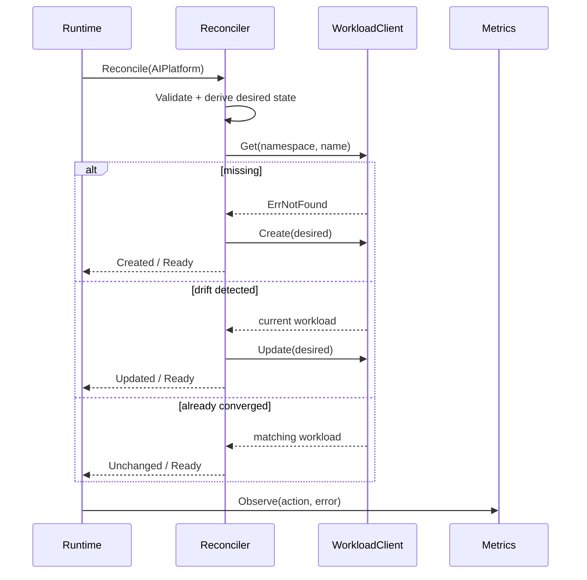

# Reconciliation sequence

```mermaid
sequenceDiagram
  participant Runtime
  participant Reconciler
  participant Client as WorkloadClient
  participant Metrics
  Runtime->>Reconciler: Reconcile(AIPlatform)
  Reconciler->>Reconciler: Validate + derive desired state
  Reconciler->>Client: Get(namespace, name)
  alt missing
    Client-->>Reconciler: ErrNotFound
    Reconciler->>Client: Create(desired)
    Reconciler-->>Runtime: Created / Ready
  else drift detected
    Client-->>Reconciler: current workload
    Reconciler->>Client: Update(desired)
    Reconciler-->>Runtime: Updated / Ready
  else already converged
    Client-->>Reconciler: matching workload
    Reconciler-->>Runtime: Unchanged / Ready
  end
  Runtime->>Metrics: Observe(action, error)
```
